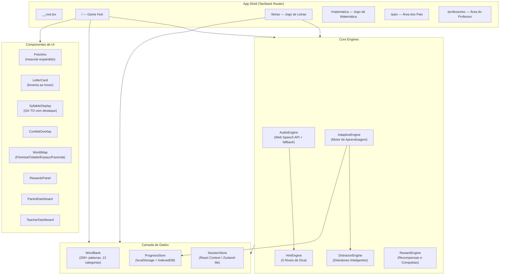
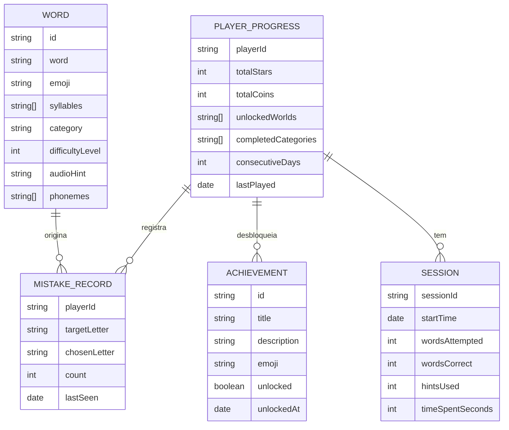
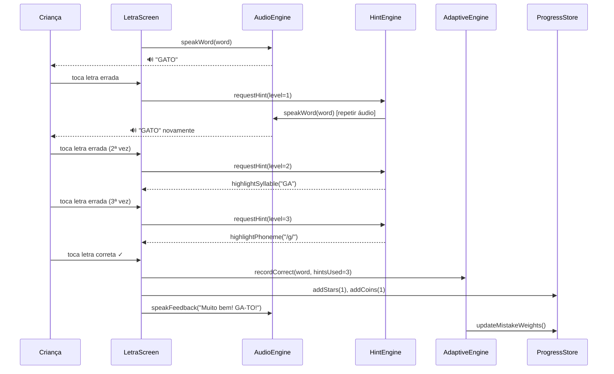
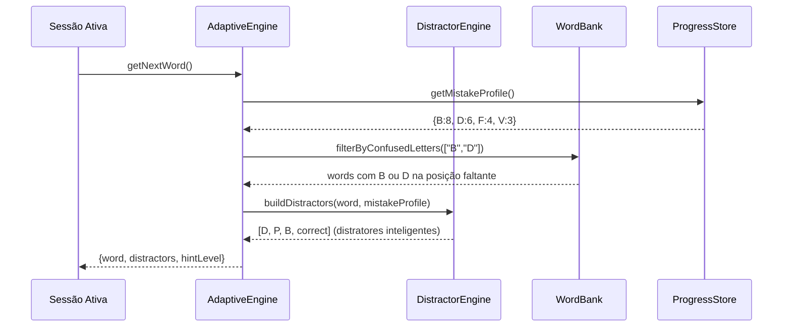

# Design Document: Plataforma de Alfabetização por Consciência Fonológica

## Visão Geral

A **Plataforma de Alfabetização** é uma evolução do app "Ilha das Letrinhas e Numerinhos" — um jogo React já existente com o mascote Polvinho. O objetivo é transformá-lo em uma plataforma completa de aprendizado baseada em **consciência fonológica**: em vez de aprender por tentativa e erro aleatória, a criança recebe pistas progressivas sobre sons, sílabas e fonemas, desenvolvendo competências linguísticas reais.

A plataforma mantém a identidade visual atual (paleta tropical, Fredoka/Baloo 2, Polvinho animado), amplia o banco de palavras de ~50 para 200+ itens em 12 categorias, introduz um motor adaptativo que detecta confusões fonológicas (B/D, F/V, P/B) e cria exercícios dirigidos, adiciona áreas para pais e professores, e implementa gamificação por mundos/fases com sistema de recompensas.

Stack mantida: React 19 + TanStack Start + TanStack Router + Vite + Tailwind CSS v4 + TypeScript. Persistência: localStorage + IndexedDB (sem backend obrigatório na fase 1).

---

## Arquitetura Geral



---

## Arquitetura de Dados



---

## Sequência Principal: Jogo de Letras com Dicas Progressivas



---

## Sequência: Motor Adaptativo



---

## Componentes e Interfaces

### AudioEngine

**Objetivo:** Encapsular toda síntese e reprodução de áudio (Web Speech API com fallback silencioso). Toda interação sonora passa por aqui.

**Interface TypeScript:**
```typescript
interface AudioConfig {
  volume: number        // 0.0 – 1.0
  rate: number          // 0.5 – 2.0
  lang: "pt-BR"
  enabled: boolean
}

interface IAudioEngine {
  speakWord(word: string): Promise<void>
  speakPhoneme(phoneme: string): Promise<void>
  speakSyllable(syllable: string): Promise<void>
  speakFeedback(message: string): Promise<void>
  playSound(effect: SoundEffect): Promise<void>
  stop(): void
  configure(config: Partial<AudioConfig>): void
  isSupported(): boolean
}

type SoundEffect = "correct" | "wrong" | "click" | "levelUp" | "achievement" | "confetti"
```

**Responsabilidades:**
- Detectar suporte à Web Speech API; silenciar graciosamente se ausente
- Falar palavras completas, sílabas isoladas e fonemas individuais
- Controlar volume e velocidade via configurações do usuário
- Reproduzir efeitos sonoros (pode usar AudioContext ou arquivos .mp3 pré-carregados)
- Cancelar fala em curso antes de iniciar nova

---

### HintEngine

**Objetivo:** Gerenciar o sistema de 5 níveis de dica para guiar a criança sem revelar imediatamente a resposta.

**Interface TypeScript:**
```typescript
type HintLevel = 1 | 2 | 3 | 4 | 5

interface HintContext {
  word: string
  syllables: string[]
  missingIndex: number
  correctLetter: string
  phoneme: string
  attemptCount: number
}

interface HintAction {
  level: HintLevel
  type: "repeatAudio" | "highlightSyllable" | "highlightPhoneme" | "flashCorrectLetter" | "revealAnswer"
  payload: string | null
  audioText: string | null
}

interface IHintEngine {
  getHint(context: HintContext): HintAction
  shouldShowHint(attemptCount: number): boolean
  reset(): void
}
```

**Níveis de dica:**
| Nível | Gatilho | Ação |
|-------|---------|------|
| 1 | 1ª tentativa errada | Repetir áudio da palavra |
| 2 | 2ª tentativa errada | Destacar sílaba com a letra faltante |
| 3 | 3ª tentativa errada | Destacar fonema da letra correta |
| 4 | 4ª tentativa errada | Piscar a opção correta |
| 5 | 5ª tentativa errada | Revelar resposta automaticamente |

---

### AdaptiveEngine

**Objetivo:** Motor de inteligência de aprendizagem — detecta padrões de erros, aplica repetição espaçada e seleciona palavras/distratores de forma dirigida.

**Interface TypeScript:**
```typescript
interface MistakeProfile {
  [letter: string]: number   // ex: { "B": 8, "D": 6 }
}

interface SpacedRepetitionEntry {
  wordId: string
  nextReviewAt: Date
  interval: number    // dias
  easeFactor: number  // SM-2 algorithm
  repetitions: number
}

interface IAdaptiveEngine {
  getNextWord(profile: MistakeProfile, availableWords: Word[]): Word
  recordAttempt(wordId: string, correct: boolean, hintsUsed: number): void
  updateMistakeProfile(targetLetter: string, chosenLetter: string): void
  getMistakeProfile(): MistakeProfile
  getConfusedPairs(): Array<[string, string]>
  getSpacedRepetitionQueue(): Word[]
  resetSession(): void
}

interface ConfusionPair {
  letters: [string, string]
  frequency: number
  category: "visual" | "phonetic"
}
```

**Pares de confusão pré-definidos:**
```typescript
const CONFUSION_PAIRS: ConfusionPair[] = [
  { letters: ["B", "D"], frequency: 0, category: "visual" },
  { letters: ["B", "P"], frequency: 0, category: "visual" },
  { letters: ["D", "Q"], frequency: 0, category: "visual" },
  { letters: ["F", "V"], frequency: 0, category: "phonetic" },
  { letters: ["S", "Z"], frequency: 0, category: "phonetic" },
  { letters: ["C", "K"], frequency: 0, category: "phonetic" },
  { letters: ["T", "D"], frequency: 0, category: "phonetic" },
  { letters: ["P", "B"], frequency: 0, category: "phonetic" },
]
```

---

### DistractorEngine

**Objetivo:** Gerar alternativas (distratores) que sigam a teoria de consciência fonológica — não aleatórias, mas pedagogicamente relevantes.

**Interface TypeScript:**
```typescript
type DifficultyLevel = 1 | 2 | 3 | 4 | 5

interface DistractorConfig {
  difficulty: DifficultyLevel
  mistakeProfile: MistakeProfile
  count: number   // número de distratores (total = count + 1 correto)
}

interface IDistractorEngine {
  generate(correctLetter: string, config: DistractorConfig): string[]
}
```

**Estratégia por dificuldade:**
| Nível | Estratégia de Distratores |
|-------|--------------------------|
| 1 | Letras muito diferentes (A vs Z vs M) |
| 2 | Letras comuns mas distintas |
| 3 | Letras visualmente próximas (B/D/P/Q) |
| 4 | Fonemas semelhantes (F/V, S/Z, C/K) |
| 5 | Combinação visual + fonética + perfil de erro da criança |

---

### ProgressStore

**Objetivo:** Persistir todo o progresso do jogador no dispositivo (localStorage para dados simples, IndexedDB para histórico detalhado).

**Interface TypeScript:**
```typescript
interface PlayerProgress {
  playerId: string
  totalStars: number
  totalCoins: number
  unlockedWorlds: WorldId[]
  completedCategories: CategoryId[]
  consecutiveDays: number
  lastPlayed: string   // ISO date
  currentDifficultyLevel: DifficultyLevel
  totalTimeSpentSeconds: number
}

interface IProgressStore {
  getProgress(): PlayerProgress
  addStars(n: number): void
  addCoins(n: number): void
  recordSession(session: Session): void
  recordMistake(targetLetter: string, chosenLetter: string): void
  recordCorrect(wordId: string): void
  getMistakeProfile(): MistakeProfile
  unlockAchievement(id: string): void
  getAchievements(): Achievement[]
  getSessionHistory(days?: number): Session[]
  exportData(): string  // JSON para exportação
  clearData(): void
}
```

---

### RewardEngine

**Objetivo:** Gerenciar moedas, estrelas, medalhas e conquistas com regras de desbloqueio.

**Interface TypeScript:**
```typescript
interface Achievement {
  id: string
  title: string
  description: string
  emoji: string
  condition: AchievementCondition
  unlocked: boolean
  unlockedAt?: Date
}

type AchievementCondition =
  | { type: "words"; count: number }
  | { type: "corrects"; count: number }
  | { type: "streak"; days: number }
  | { type: "category"; categoryId: string }
  | { type: "nohints"; count: number }

interface IRewardEngine {
  checkAchievements(progress: PlayerProgress): Achievement[]
  calculateStarsForAttempt(hintsUsed: number): number  // 0–3 estrelas
  calculateCoinsForSession(session: Session): number
  getUnlockedAchievements(): Achievement[]
}
```

**Tabela de conquistas:**
| ID | Título | Condição | Emoji |
|----|--------|----------|-------|
| first-word | Primeira Palavra | 1 palavra certa | 📖 |
| ten-words | Leitor Iniciante | 10 palavras | 🌟 |
| fifty-corrects | Campeão das Letras | 50 acertos | 🏆 |
| hundred-corrects | Mestre da Leitura | 100 acertos | 👑 |
| seven-days | Semana Perfeita | 7 dias consecutivos | 🔥 |
| category-done | Mestre dos Animais* | Categoria completa | 🐾 |
| no-hints | Independente | 5 seguidas sem dicas | 💡 |

---

## Modelos de Dados

### Word

```typescript
interface Word {
  id: string                    // ex: "gato-001"
  word: string                  // "GATO"
  displayWord: string           // "GA•TO" (separação silábica)
  syllables: string[]           // ["GA", "TO"]
  emoji: string                 // "🐱"
  category: CategoryId
  difficultyLevel: DifficultyLevel  // 1–5
  phonemes: string[]            // ["/g/", "/a/", "/t/", "/o/"]
  audioHint: string             // texto para TTS: "gato"
  syllableWithMissingLetter: number  // índice da sílaba (0=GA, 1=TO)
}

type CategoryId =
  | "animais" | "frutas" | "objetos" | "escola"
  | "casa" | "natureza" | "corpo" | "transportes"
  | "profissoes" | "cores" | "numeros" | "brinquedos"
```

**Regras de validação:**
- `word.length` entre 3 e 10 caracteres
- `syllables.join("") === word` (sílabas reconstroem a palavra)
- `phonemes.length >= syllables.length`
- `difficultyLevel` entre 1 e 5

### World / Phase Map

```typescript
interface World {
  id: WorldId
  name: string
  emoji: string
  bgColor: string
  unlockCondition: { stars: number }
  phases: Phase[]
}

interface Phase {
  id: string
  worldId: WorldId
  number: number
  words: string[]         // Word IDs
  completed: boolean
  stars: number           // 0–3
  unlocked: boolean
}

type WorldId = "floresta" | "cidade" | "espaco" | "fazenda"

const WORLDS: World[] = [
  { id: "floresta", name: "Floresta Mágica", emoji: "🌲", unlockCondition: { stars: 0 } },
  { id: "cidade",   name: "Cidade Alegre",   emoji: "🏙️", unlockCondition: { stars: 30 } },
  { id: "espaco",   name: "Espaço Sideral",  emoji: "🚀", unlockCondition: { stars: 80 } },
  { id: "fazenda",  name: "Fazenda do Sol",  emoji: "🌻", unlockCondition: { stars: 150 } },
]
```

---

## Tratamento de Erros

### Erro 1: Web Speech API não suportada

**Condição:** `window.speechSynthesis` é `undefined` (iOS WebView antigo, navegadores sem suporte)
**Resposta:** AudioEngine retorna `isSupported() === false`; UI exibe ícone 🔇 em vez de 🔊; botões de áudio ficam visualmente desabilitados mas o jogo continua normalmente
**Recuperação:** Nenhuma ação do usuário necessária; experiência visual permanece completa

### Erro 2: IndexedDB indisponível

**Condição:** Ambiente de privacidade estrita ou modo anônimo bloqueia IndexedDB
**Resposta:** ProgressStore faz fallback para localStorage puro; limita histórico a últimos 30 dias
**Recuperação:** Transparente para o usuário; aviso sutil na área dos pais

### Erro 3: Palavra sem sílabas definidas

**Condição:** Word no banco sem campo `syllables` preenchido
**Resposta:** SyllableDisplay exibe a palavra inteira sem separação (GA•TO → GATO); HintEngine pula nível 2 (destaque de sílaba)
**Recuperação:** Log silencioso para monitoramento; jogo continua com dicas de nível 1, 3, 4 e 5

### Erro 4: TTS não fala fonema isolado corretamente

**Condição:** Web Speech API lê "/b/" como "barra b barra" em vez do som /b/
**Resposta:** Mapa de fonemas → texto fonético alternativo para TTS (ex: "/b/" → "bê")
**Recuperação:** Fallback interno no AudioEngine via `PHONEME_TTS_MAP`

---

## Estratégia de Testes

### Testes Unitários

- `AdaptiveEngine.getNextWord()`: deve priorizar palavras com letras do perfil de erros
- `DistractorEngine.generate()`: não deve retornar o correto como distrator; deve respeitar nível de dificuldade
- `HintEngine.getHint()`: deve retornar o nível correto para cada `attemptCount`
- `RewardEngine.checkAchievements()`: deve desbloquear conquistas exatamente uma vez
- `ProgressStore`: serialização/deserialização deve ser idempotente

### Testes Baseados em Propriedades (Property-Based Testing)

**Biblioteca:** `fast-check`

**Propriedade 1: Distratores nunca incluem a letra correta**
```typescript
fc.property(fc.string(), fc.integer({ min: 1, max: 5 }), (letter, difficulty) => {
  const distractors = distractorEngine.generate(letter, { difficulty, count: 3 })
  return !distractors.includes(letter)
})
```

**Propriedade 2: Número de opções respeita a dificuldade**
```typescript
fc.property(fc.integer({ min: 1, max: 5 }), (level) => {
  const count = optionCountForLevel(level)
  return count >= 2 && count <= 6
})
```

**Propriedade 3: Sílabas reconstruem a palavra**
```typescript
fc.property(fc.constantFrom(...WORD_BANK), (word) => {
  return word.syllables.join("") === word.word
})
```

**Propriedade 4: ProgressStore é idempotente**
```typescript
fc.property(fc.integer({ min: 0, max: 1000 }), (stars) => {
  store.addStars(stars)
  const p1 = store.getProgress().totalStars
  store.addStars(0)
  return store.getProgress().totalStars === p1
})
```

### Testes de Integração

- Fluxo completo: palavra → erro → dica nível 1..5 → revelar → próxima palavra
- ProgressStore persistindo e recarregando entre sessões
- WorldMap desbloqueando fases conforme estrelas acumuladas

---

## Performance

- **Lazy loading:** rotas `/pais` e `/professores` carregadas sob demanda via `React.lazy`
- **Code splitting:** cada World é um chunk separado pelo Vite
- **Cache de áudio:** AudioEngine mantém pool de vozes do `speechSynthesis.getVoices()`; phoneme map em memória
- **Banco de palavras:** carregado uma vez na inicialização do app via módulo estático; filtrado em memória
- **IndexedDB:** writes em batch ao fim da sessão, não por cada interação
- **Animações:** CSS `@keyframes` + `will-change: transform` para confete; sem libs de animação pesadas
- **Imagens:** todos os recursos visuais são emojis (zero bytes de imagem externa)

---

## Segurança e Privacidade

- Nenhum dado é enviado a servidores externos — tudo local no dispositivo
- Área dos pais protegida por PIN numérico simples (armazenado como hash SHA-256 no localStorage)
- Área do professor: autenticação por código de turma (sem backend na fase 1; exportação em JSON local)
- Dados exportados não contêm identificadores pessoais além do nome de usuário opcional
- Conformidade LGPD: sem coleta de dados de menores fora do dispositivo

---

## Acessibilidade (WCAG 2.1 AA)

- Todos os botões interativos: `min 44×44px`, `aria-label` descritivo
- Contraste mínimo: 4.5:1 para texto normal; 3:1 para texto grande
- Modo alto contraste: seletor CSS `prefers-contrast: more`
- Modo daltônico: paleta alternativa `prefers-color-scheme: ...` + toggle manual
- Navegação por teclado: `Tab` order lógico; `Enter`/`Space` ativam botões
- Leitor de tela: `aria-live="polite"` para feedback de acerto/erro; imagens decorativas `aria-hidden="true"`
- Controle de velocidade e volume da fala: expostos nas configurações
- Legendas opcionais: texto do feedback sempre visível além do áudio

---

## Design Low-Level: Algoritmos com Especificações Formais

---

### Algoritmo Principal: processWordAttempt

```typescript
// Algoritmo: processWordAttempt
// Entrada: chosenLetter (string), context (WordChallengeContext)
// Saída: AttemptResult
//
// Precondições:
//   - chosenLetter é uma letra maiúscula A-Z
//   - context.correctLetter é uma letra maiúscula A-Z
//   - context.attemptCount >= 0
//   - context.word é não-vazio
//
// Pós-condições:
//   - Se correto: result.correct === true, result.stars >= 1
//   - Se errado: result.correct === false, result.hintAction definido
//   - context.attemptCount é incrementado em caso de erro
//   - MistakeProfile é atualizado em caso de erro
//   - Nunca lança exceção não tratada

function processWordAttempt(
  chosenLetter: string,
  context: WordChallengeContext
): AttemptResult {
  // ASSERT: chosenLetter é válida
  if (!isValidLetter(chosenLetter)) {
    return { correct: false, hintAction: null, error: "invalid_input" }
  }

  if (chosenLetter === context.correctLetter) {
    // Acerto
    const stars = rewardEngine.calculateStarsForAttempt(context.attemptCount)
    const coins = stars >= 3 ? 2 : 1

    // ASSERT pós-condição: stars entre 1 e 3
    return {
      correct: true,
      stars,
      coins,
      feedback: buildFeedbackMessage(context.word, context.syllables),
      soundEffect: "correct",
    }
  } else {
    // Erro
    const newAttemptCount = context.attemptCount + 1
    adaptiveEngine.updateMistakeProfile(context.correctLetter, chosenLetter)
    const hintAction = hintEngine.getHint({
      ...context,
      attemptCount: newAttemptCount,
    })

    // ASSERT pós-condição: hintAction.level entre 1 e 5
    return {
      correct: false,
      hintAction,
      newAttemptCount,
      soundEffect: "wrong",
    }
  }
}
```

---

### Algoritmo: getNextWord (Seleção Adaptativa)

```typescript
// Algoritmo: getNextWord
// Entrada: MistakeProfile, Word[], sessionHistory: string[]
// Saída: Word selecionada
//
// Precondições:
//   - availableWords.length >= 1
//   - mistakeProfile pode ser vazio {}
//   - sessionHistory é array (pode ser vazio)
//
// Pós-condições:
//   - Retorna Word do array availableWords
//   - Palavras com letras confundidas têm peso maior
//   - Mesma palavra não repete nas últimas 5 seleções (se banco > 5)
//   - Aplica SM-2 para palavras com repetição espaçada pendente
//
// Invariante de loop:
//   - Em cada iteração do cálculo de peso: totalWeight > 0

function getNextWord(
  mistakeProfile: MistakeProfile,
  availableWords: Word[],
  sessionHistory: string[]
): Word {
  // ASSERT: banco não vazio
  if (availableWords.length === 0) throw new Error("WordBank empty")

  // Calcular peso para cada palavra
  const weights: number[] = availableWords.map((word) => {
    let weight = 1.0

    // Verificar repetição espaçada
    const srEntry = spacedRepetitionStore.get(word.id)
    if (srEntry && srEntry.nextReviewAt <= new Date()) {
      weight *= 3.0  // Prioridade alta para revisão pendente
    }

    // Boost baseado em perfil de erros
    for (const letter of word.word.split("")) {
      const mistakeCount = mistakeProfile[letter] ?? 0
      if (mistakeCount > 0) {
        weight += mistakeCount * 0.5
      }
    }

    // Penalidade por recência (últimas 5 sessões)
    if (sessionHistory.slice(-5).includes(word.id)) {
      weight *= 0.1
    }

    // INVARIANTE: weight > 0
    return Math.max(weight, 0.01)
  })

  // Seleção por roleta (weighted random)
  const totalWeight = weights.reduce((sum, w) => sum + w, 0)
  // ASSERT: totalWeight > 0
  let random = Math.random() * totalWeight
  for (let i = 0; i < availableWords.length; i++) {
    random -= weights[i]
    if (random <= 0) return availableWords[i]
  }
  return availableWords[availableWords.length - 1]
}
```

---

### Algoritmo: generateDistractors

```typescript
// Algoritmo: generateDistractors
// Entrada: correctLetter (string), config (DistractorConfig)
// Saída: string[] — distratores (sem incluir correctLetter)
//
// Precondições:
//   - correctLetter é letra maiúscula A-Z
//   - config.count entre 1 e 5
//   - config.difficulty entre 1 e 5
//
// Pós-condições:
//   - result.length === config.count
//   - !result.includes(correctLetter)
//   - Todos os elementos são letras maiúsculas A-Z únicas
//
// Invariante de loop:
//   - candidates nunca contém correctLetter
//   - Não há duplicatas em result

function generateDistractors(
  correctLetter: string,
  config: DistractorConfig
): string[] {
  const { difficulty, mistakeProfile, count } = config
  const result: string[] = []
  const used = new Set<string>([correctLetter])

  // NÍVEL 5: Usar perfil de erros da criança
  if (difficulty >= 5) {
    const confused = Object.entries(mistakeProfile)
      .filter(([letter]) => letter !== correctLetter)
      .sort(([, a], [, b]) => b - a)
      .map(([letter]) => letter)
    for (const letter of confused) {
      if (result.length >= count) break
      if (!used.has(letter)) {
        result.push(letter)
        used.add(letter)
      }
    }
  }

  // NÍVEIS 3-4: Letras visualmente/foneticamente próximas
  if (difficulty >= 3 && result.length < count) {
    const visuals = VISUAL_SIMILAR[correctLetter] ?? []
    const phonetics = PHONETIC_SIMILAR[correctLetter] ?? []
    const pool = difficulty >= 4
      ? [...phonetics, ...visuals]
      : visuals
    for (const letter of pool) {
      if (result.length >= count) break
      if (!used.has(letter)) {
        result.push(letter)
        used.add(letter)
      }
    }
  }

  // Completar com letras aleatórias se necessário
  const alphabet = "ABCDEFGHIJLMNOPQRSTUVZ".split("")
  let guard = 0
  while (result.length < count && guard++ < 100) {
    const letter = alphabet[Math.floor(Math.random() * alphabet.length)]
    if (!used.has(letter)) {
      result.push(letter)
      used.add(letter)
    }
  }

  // ASSERT pós-condição
  // result.length === count
  // !result.includes(correctLetter)
  return result.slice(0, count)
}

// Mapa de similaridade visual
const VISUAL_SIMILAR: Record<string, string[]> = {
  B: ["D", "P", "Q", "R"],
  D: ["B", "P", "Q"],
  P: ["B", "D", "Q", "R"],
  Q: ["G", "O", "D"],
  M: ["N", "W"],
  N: ["M", "U"],
  F: ["E", "T"],
  I: ["J", "L"],
}

// Mapa de similaridade fonética
const PHONETIC_SIMILAR: Record<string, string[]> = {
  B: ["P", "V"],
  V: ["F", "B"],
  F: ["V"],
  S: ["Z", "C"],
  Z: ["S"],
  C: ["K", "Q", "S"],
  K: ["C", "Q"],
  T: ["D"],
  D: ["T"],
  G: ["J"],
  J: ["G"],
}
```

---

### Algoritmo: SM-2 (Repetição Espaçada)

```typescript
// Algoritmo: updateSpacedRepetition (baseado em SM-2)
// Entrada: entry (SpacedRepetitionEntry), quality (0–5)
//   quality: 5=perfeito, 4=correto, 3=correto com dificuldade,
//            2=erro mas lembrou, 1=erro grave, 0=blackout total
// Saída: SpacedRepetitionEntry atualizado
//
// Precondições:
//   - quality entre 0 e 5
//   - entry.easeFactor >= 1.3
//   - entry.interval >= 1
//
// Pós-condições:
//   - Se quality >= 3: interval aumenta (próxima revisão mais distante)
//   - Se quality < 3: interval reseta para 1 (revisar logo)
//   - easeFactor nunca cai abaixo de 1.3

function updateSpacedRepetition(
  entry: SpacedRepetitionEntry,
  quality: number  // 0–5
): SpacedRepetitionEntry {
  let { interval, easeFactor, repetitions } = entry

  if (quality >= 3) {
    // Resposta correta
    if (repetitions === 0) interval = 1
    else if (repetitions === 1) interval = 6
    else interval = Math.round(interval * easeFactor)

    easeFactor = easeFactor + 0.1 - (5 - quality) * (0.08 + (5 - quality) * 0.02)
    easeFactor = Math.max(1.3, easeFactor)  // INVARIANTE: easeFactor >= 1.3
    repetitions += 1
  } else {
    // Resposta errada: resetar
    interval = 1
    repetitions = 0
    // easeFactor não muda em caso de erro
  }

  const nextReviewAt = new Date()
  nextReviewAt.setDate(nextReviewAt.getDate() + interval)

  // ASSERT: interval >= 1
  return { ...entry, interval, easeFactor, repetitions, nextReviewAt }
}
```

---

### Hook: useWordChallenge

```typescript
// Hook que orquestra a lógica de um desafio de palavra completo
// Integra: AdaptiveEngine + HintEngine + AudioEngine + ProgressStore

interface UseWordChallengeResult {
  currentWord: Word
  missingIndex: number
  displayWord: string          // "GA•TO" com "?" no lugar da letra
  options: string[]            // letras para escolher (correto + distratores)
  feedback: FeedbackState | null
  hintAction: HintAction | null
  attemptCount: number
  isRevealed: boolean
  onLetterPick: (letter: string) => void
  onRequestHint: () => void
  onNextWord: () => void
  onHearWord: () => void
}

function useWordChallenge(categoryFilter?: CategoryId): UseWordChallengeResult {
  const [word, setWord] = useState<Word>(() => adaptiveEngine.getNextWord(...))
  const [attemptCount, setAttemptCount] = useState(0)
  const [hintAction, setHintAction] = useState<HintAction | null>(null)
  const [feedback, setFeedback] = useState<FeedbackState | null>(null)

  // Precondição: word sempre existe (WordBank não vazio)
  // Pós-condição: após onNextWord(), attemptCount === 0 e hintAction === null

  const onLetterPick = useCallback((letter: string) => {
    if (feedback?.type === "correct") return  // Ignorar cliques pós-acerto

    const result = processWordAttempt(letter, {
      word: word.word,
      correctLetter: word.word[word.missingIndex],
      syllables: word.syllables,
      attemptCount,
    })

    if (result.correct) {
      audioEngine.speakFeedback(result.feedback)
      audioEngine.playSound("correct")
      progressStore.addStars(result.stars)
      progressStore.addCoins(result.coins)
      setFeedback({ type: "correct", stars: result.stars, message: result.feedback })
    } else {
      audioEngine.playSound("wrong")
      setAttemptCount(result.newAttemptCount)
      setHintAction(result.hintAction)
      if (result.hintAction.audioText) {
        audioEngine.speakFeedback(result.hintAction.audioText)
      }
      setFeedback({ type: "wrong", hintLevel: result.hintAction.level })
    }
  }, [word, attemptCount, feedback])

  // ... restante do hook
}
```

---

### Componente: SyllableDisplay

```typescript
// Componente: SyllableDisplay
// Exibe a palavra com separação silábica, destacando sílaba relevante
// e substituindo a letra faltante por "?"
//
// Precondições:
//   - word.syllables.join("") === word.word
//   - missingIndex < word.word.length
//   - highlightedSyllable é opcional
//
// Pós-condições visuais:
//   - Cada sílaba é um span separado
//   - Sílaba com letra faltante tem fundo var(--sky)
//   - Separador "•" entre sílabas é aria-hidden
//   - Acerto: fundo var(--leaf) + texto branco

interface SyllableDisplayProps {
  word: Word
  missingIndex: number
  revealedLetter?: string
  highlightedSyllable?: number  // índice da sílaba (do HintEngine nível 2)
  shake?: boolean
}

function SyllableDisplay({
  word, missingIndex, revealedLetter, highlightedSyllable, shake,
}: SyllableDisplayProps) {
  // Mapear letras para sílabas
  let charPointer = 0
  const syllableData = word.syllables.map((syl, sylIdx) => {
    const chars = syl.split("").map((char, charIdx) => {
      const globalIdx = charPointer + charIdx
      const isMissing = globalIdx === missingIndex
      return { char, globalIdx, isMissing }
    })
    charPointer += syl.length
    return { syllable: syl, chars, index: sylIdx }
  })

  return (
    <div
      className={cn("flex justify-center gap-1 flex-wrap", shake && "animate-shake")}
      aria-label={`Palavra: ${word.word.split("").map((l, i) => i === missingIndex ? "?" : l).join(" ")}`}
    >
      {syllableData.map((syl, i) => (
        <Fragment key={i}>
          {i > 0 && <span className="text-muted-foreground text-3xl self-center" aria-hidden="true">•</span>}
          <div
            className={cn(
              "flex gap-0.5",
              highlightedSyllable === i && "ring-4 ring-ocean rounded-xl scale-110 transition-transform"
            )}
          >
            {syl.chars.map(({ char, globalIdx, isMissing }) => (
              <LetterBox
                key={globalIdx}
                letter={isMissing ? (revealedLetter ?? "?") : char}
                isMissing={isMissing && !revealedLetter}
                isRevealed={isMissing && !!revealedLetter}
              />
            ))}
          </div>
        </Fragment>
      ))}
    </div>
  )
}
```

---

### Componente: LetterCard (fonema ao hover/touch)

```typescript
// Componente: LetterCard
// Botão de alternativa que emite o fonema da letra ao hover/touch
//
// Precondições:
//   - letter é A-Z maiúsculo
//   - onPick é função estável (useCallback)
//
// Pós-condições:
//   - hover/touchStart: emite fonema via AudioEngine
//   - click: chama onPick(letter)
//   - aria-label: "Letra [letter], som [phoneme]"

interface LetterCardProps {
  letter: string
  onPick: (letter: string) => void
  disabled?: boolean
  highlighted?: boolean   // HintEngine nível 4: piscar
  size: "sm" | "md" | "lg"
}

// Mapa de fonemas para TTS (português brasileiro)
const PHONEME_MAP: Record<string, string> = {
  A: "a", B: "bê", C: "cê", D: "dê", E: "e", F: "efe",
  G: "guê", H: "agá", I: "i", J: "jota", K: "cá", L: "ele",
  M: "eme", N: "ene", O: "o", P: "pê", Q: "quê", R: "erre",
  S: "esse", T: "tê", U: "u", V: "vê", X: "xis", Z: "zê",
}

function LetterCard({ letter, onPick, disabled, highlighted, size }: LetterCardProps) {
  const handleHover = useCallback(() => {
    if (!disabled && audioEngine.isSupported()) {
      audioEngine.speakPhoneme(PHONEME_MAP[letter] ?? letter)
    }
  }, [letter, disabled])

  return (
    <button
      onMouseEnter={handleHover}
      onTouchStart={handleHover}
      onClick={() => !disabled && onPick(letter)}
      disabled={disabled}
      aria-label={`Letra ${letter}, som ${PHONEME_MAP[letter] ?? letter}`}
      className={cn(
        "rounded-2xl font-display font-bold border-4 border-foreground/15 chunky-shadow-sm",
        "transition hover:-translate-y-0.5 active:translate-y-0.5",
        "bg-accent text-foreground",
        highlighted && "animate-pulse ring-4 ring-sun",
        size === "sm" && "w-14 h-14 text-2xl",
        size === "md" && "w-16 h-16 md:w-20 md:h-20 text-3xl md:text-4xl",
        size === "lg" && "w-20 h-20 text-4xl",
        disabled && "opacity-50 cursor-not-allowed",
      )}
    >
      {letter}
    </button>
  )
}
```

---

## Estrutura de Arquivos Proposta

```
src/
├── roumao/                         # Rotas TanStack Router
│   ├── __root.tsx
│   ├── index.tsx                   # Game Hub / World Map
│   ├── letras/
│   │   └── index.tsx               # Jogo de Letras
│   ├── matematica/
│   │   └── index.tsx               # Jogo de Matemática
│   ├── pais/
│   │   └── index.tsx               # Área dos Pais (lazy)
│   └── professores/
│       └── index.tsx               # Área do Professor (lazy)
│
├── components/
│   ├── Polvinho.tsx                # Mascote expandido (novas expressões)
│   ├── Star.tsx
│   ├── SyllableDisplay.tsx         # NOVO: exibição silábica
│   ├── LetterCard.tsx              # NOVO: botão com fonema
│   ├── HintBanner.tsx              # NOVO: banner de dica
│   ├── ConfettiOverlay.tsx         # NOVO: confete CSS puro
│   ├── WorldMap.tsx                # NOVO: mapa de mundos
│   ├── RewardsPanel.tsx            # NOVO: painel de conquistas
│   └── ui/                         # shadcn/ui existente
│
├── engines/                        # NOVO: motores de lógica
│   ├── AudioEngine.ts
│   ├── HintEngine.ts
│   ├── AdaptiveEngine.ts
│   ├── DistractorEngine.ts
│   ├── RewardEngine.ts
│   └── SpacedRepetition.ts
│
├── data/                           # NOVO: banco de dados estático
│   ├── words/
│   │   ├── animais.ts
│   │   ├── frutas.ts
│   │   ├── objetos.ts
│   │   ├── escola.ts
│   │   ├── casa.ts
│   │   ├── natureza.ts
│   │   ├── corpo.ts
│   │   ├── transportes.ts
│   │   ├── profissoes.ts
│   │   ├── cores.ts
│   │   ├── numeros.ts
│   │   └── brinquedos.ts
│   ├── achievements.ts
│   ├── worlds.ts
│   └── phonemes.ts                 # Mapas de fonemas
│
├── stores/                         # NOVO: persistência
│   ├── ProgressStore.ts            # localStorage + IndexedDB
│   └── SessionStore.ts             # React Context in-memory
│
├── hooks/                          # NOVO: hooks reutilizáveis
│   ├── useWordChallenge.ts
│   ├── useAudio.ts
│   ├── useProgress.ts
│   ├── useRewards.ts
│   └── useAdaptive.ts
│
├── types/                          # NOVO: tipos TypeScript
│   └── index.ts
│
├── biblioteca/                     # Existente
│   └── utils.ts
│
└── queks/                          # Existente
    └── use-mobile.tsx
```

---

## Dependências

**Mantidas (já no projeto):**
- React 19, TanStack Router/Start, Vite, Tailwind CSS v4
- Radix UI (todos os componentes já instalados)
- Lucide React, Recharts (para gráfico de evolução na área dos pais)
- Sonner (toasts para notificações de conquistas)
- Fontsource Fredoka + Baloo 2

**Novas (a avaliar):**
- `fast-check` — property-based testing (devDependency)
- `idb` — wrapper tipado para IndexedDB (pequeno, ~3KB gzipped)

**Não necessárias (usar APIs nativas):**
- Sem biblioteca de animação (CSS puro via Tailwind)
- Sem biblioteca de áudio (Web Speech API + AudioContext nativo)
- Sem biblioteca de confete (CSS @keyframes customizado)
- Sem biblioteca de estado global (React Context + hooks customizados)
## Low-Level Section

Testing write...
## Design Low-Level: Algoritmos com Especificacoes Formais

### Algoritmo Principal: processWordAttempt

Funcao que processa cada tentativa da crianca, decidindo acerto ou erro e acionando o motor de dicas.

**Interface TypeScript:**

interface AttemptResult {
  correct: boolean
  stars?: number
  coins?: number
  feedback?: string
  soundEffect: SoundEffect
  hintAction?: HintAction
  newAttemptCount?: number
}

interface WordChallengeContext {
  word: string
  syllables: string[]
  missingIndex: number
  correctLetter: string
  phoneme: string
  attemptCount: number
}

**Precondicoes:**
- chosenLetter e uma letra maiuscula A-Z
- context.correctLetter e uma letra maiuscula A-Z
- context.attemptCount >= 0

**Poscondicoes:**
- Se correto: result.correct === true, result.stars entre 1 e 3
- Se errado: result.correct === false, result.hintAction definido
- MistakeProfile e atualizado em caso de erro
- Nunca lanca excecao nao tratada

**Pseudocodigo (TypeScript):**

function processWordAttempt(chosenLetter, context) {
  if (!isValidLetter(chosenLetter)) return { correct: false, error: 'invalid_input' }
  if (chosenLetter === context.correctLetter) {
    const stars = calculateStars(context.attemptCount)  // 3=sem erros, 2=1 erro, 1=muitos
    return { correct: true, stars, coins: stars >= 3 ? 2 : 1,
             feedback: buildFeedbackMessage(context), soundEffect: 'correct' }
  } else {
    const newCount = context.attemptCount + 1
    adaptiveEngine.updateMistakeProfile(context.correctLetter, chosenLetter)
    const hint = hintEngine.getHint({ ...context, attemptCount: newCount })
    return { correct: false, hintAction: hint, newAttemptCount: newCount, soundEffect: 'wrong' }
  }
}

**Calculo de estrelas por tentativas:**
- 0 erros: 3 estrelas
- 1-2 erros: 2 estrelas
- 3-4 erros: 1 estrela
- 5+ erros (revelado): 0 estrelas (mas ainda conta como aprendizado)


### Algoritmo: getNextWord (Selecao Adaptativa com Peso)

Seleciona a proxima palavra priorizando letras confundidas e revisao espacada.

**Precondicoes:**
- availableWords.length >= 1
- mistakeProfile pode ser objeto vazio
- sessionHistory e array (pode ser vazio)

**Poscondicoes:**
- Retorna Word existente no array availableWords
- Palavras com letras confundidas tem peso maior (factor 0.5 por erro)
- Palavras pendentes de revisao espacada tem weight multiplicado por 3.0
- Mesma palavra nao repete nas ultimas 5 selecoes (se banco > 5)
- Invariante de loop: totalWeight > 0 em cada iteracao

**Pseudocodigo:**

function getNextWord(mistakeProfile, availableWords, sessionHistory) {
  ASSERT availableWords.length >= 1

  weights = availableWords.map(word => {
    weight = 1.0

    // Prioridade por revisao espacada
    srEntry = spacedRepetitionStore.get(word.id)
    IF srEntry AND srEntry.nextReviewAt <= NOW THEN
      weight *= 3.0
    END IF

    // Boost por perfil de erros
    FOR EACH letter IN word.word.split("") DO
      mistakeCount = mistakeProfile[letter] ?? 0
      weight += mistakeCount * 0.5
      // INVARIANTE: weight > 0 ao fim de cada iteracao
    END FOR

    // Penalidade por recencia (ultimas 5)
    IF sessionHistory.slice(-5).includes(word.id) THEN
      weight *= 0.1
    END IF

    RETURN max(weight, 0.01)  // nunca zero
  })

  // Selecao por roleta (weighted random)
  totalWeight = sum(weights)
  ASSERT totalWeight > 0
  random = Math.random() * totalWeight

  FOR i = 0 TO availableWords.length - 1 DO
    random -= weights[i]
    IF random <= 0 THEN RETURN availableWords[i]
  END FOR

  RETURN availableWords[last]
}


### Algoritmo: generateDistractors (Distratores Inteligentes)

Gera alternativas erradas pedagogicamente relevantes, nunca aleatorias.

**Precondicoes:**
- correctLetter e letra maiuscula A-Z
- config.count entre 1 e 5
- config.difficulty entre 1 e 5

**Poscondicoes:**
- result.length === config.count
- !result.includes(correctLetter)
- Todos os elementos sao letras maiusculas A-Z unicas
- Invariante de loop: set 'used' sempre contem correctLetter

**Pseudocodigo:**

function generateDistractors(correctLetter, config) {
  result = []
  used = Set containing correctLetter  // INVARIANTE: always contains correct

  IF config.difficulty >= 5 THEN
    // Usar perfil de erros da crianca (letras mais confundidas)
    confused = sort mistakeProfile entries by count DESC
    FOR EACH letter IN confused WHERE letter NOT IN used DO
      IF result.length >= config.count THEN BREAK
      result.push(letter); used.add(letter)
    END FOR
  END IF

  IF config.difficulty >= 3 AND result.length < config.count THEN
    // Letras visualmente/foneticamente proximas
    pool = (difficulty >= 4) ? PHONETIC_SIMILAR[correct] + VISUAL_SIMILAR[correct]
                              : VISUAL_SIMILAR[correct]
    FOR EACH letter IN pool WHERE letter NOT IN used DO
      IF result.length >= config.count THEN BREAK
      result.push(letter); used.add(letter)
    END FOR
  END IF

  // Completar com letras aleatorias
  WHILE result.length < config.count DO
    letter = randomFromAlphabet()
    IF letter NOT IN used THEN
      result.push(letter); used.add(letter)
    END IF
  END WHILE

  // ASSERT: result.length === config.count AND !result.includes(correctLetter)
  RETURN result.slice(0, config.count)
}

**Mapas de Similaridade (embutidos):**

VISUAL_SIMILAR = {
  B: [D, P, Q, R], D: [B, P, Q], P: [B, D, Q, R],
  Q: [G, O, D], M: [N, W], N: [M, U], F: [E, T], I: [J, L]
}

PHONETIC_SIMILAR = {
  B: [P, V], V: [F, B], F: [V], S: [Z, C], Z: [S],
  C: [K, Q, S], K: [C, Q], T: [D], D: [T], G: [J], J: [G]
}


### Algoritmo: SM-2 (Repeticao Espacada)

Implementacao do algoritmo SuperMemo-2 para agendar revisoes das palavras no momento otimo.

**Precondicoes:**
- quality entre 0 e 5 (5=perfeito, 0=blackout)
- entry.easeFactor >= 1.3
- entry.interval >= 1

**Poscondicoes:**
- Se quality >= 3: interval aumenta (proxima revisao mais distante)
- Se quality < 3: interval reseta para 1 (revisar logo)
- easeFactor NUNCA cai abaixo de 1.3 (INVARIANTE)
- nextReviewAt e sempre no futuro

**Pseudocodigo:**

function updateSpacedRepetition(entry, quality) {
  { interval, easeFactor, repetitions } = entry

  IF quality >= 3 THEN
    // Resposta correta: aumentar intervalo
    IF repetitions === 0 THEN interval = 1
    ELSE IF repetitions === 1 THEN interval = 6
    ELSE interval = round(interval * easeFactor)

    easeFactor = easeFactor + 0.1 - (5 - quality) * (0.08 + (5 - quality) * 0.02)
    easeFactor = max(1.3, easeFactor)  // INVARIANTE: nunca abaixo de 1.3
    repetitions += 1
  ELSE
    // Resposta errada: resetar
    interval = 1
    repetitions = 0
    // easeFactor nao muda em erro
  END IF

  nextReviewAt = TODAY + interval days

  // ASSERT: interval >= 1 AND easeFactor >= 1.3
  RETURN { ...entry, interval, easeFactor, repetitions, nextReviewAt }
}

**Mapeamento quality -> situacao de jogo:**
- 5: acerto sem nenhum erro nem dica
- 4: acerto com 1 erro ou 1 dica
- 3: acerto com 2-3 erros/dicas
- 2: acerto so com revelacao (hint level 5)
- 1: palavra pulada
- 0: nao usado diretamente (reservado)


### Assinaturas Principais de Hooks

hook useWordChallenge(categoryFilter?: CategoryId): UseWordChallengeResult
  Orquestra a logica completa de um desafio de palavra.
  - Precondicao: WordBank nao vazio para a categoria
  - Poscondicao: apos onNextWord(), attemptCount === 0 e hintAction === null
  - Expoe: currentWord, displayWord, options, feedback, hintAction, onLetterPick, onNextWord, onHearWord

hook useAudio(): UseAudioResult
  Expoe AudioEngine como hook React.
  - Inicializa WebSpeechAPI na montagem; cancela na desmontagem
  - Expoe: speak, speakPhoneme, playSound, isSupported, configure

hook useProgress(): UseProgressResult
  Conecta ao ProgressStore com re-render reativo.
  - Expoe: progress, addStars, addCoins, recordSession, getMistakeProfile

hook useRewards(): UseRewardsResult
  Monitora conquistas e dispara notificacoes.
  - Poscondicao: cada conquista e desbloqueada exatamente uma vez (idempotente)
  - Expoe: achievements, checkAndUnlock, getNewAchievements

hook useAdaptive(): UseAdaptiveResult
  Interface para o AdaptiveEngine.
  - Expoe: getNextWord, recordAttempt, getConfusedPairs, mistakeProfile


### Assinaturas Principais de Componentes

SyllableDisplay({ word, missingIndex, revealedLetter?, highlightedSyllable?, shake? })
  Exibe palavra com separacao silabica "GA•TO" com "?" no lugar da letra faltante.
  Destaca sílaba indicada pelo HintEngine nivel 2.

LetterCard({ letter, onPick, disabled?, highlighted?, size })
  Botao de alternativa. Emite fonema ao hover/touchStart via AudioEngine.
  Destaque pulsante quando highlighted (HintEngine nivel 4).

HintBanner({ hintAction, word })
  Exibe mensagem de dica contextual: "Ouça a sílaba GA..." "A letra correta soa como /g/..."
  aria-live="polite" para leitores de tela.

ConfettiOverlay({ active })
  Confete CSS puro (sem libs). Particulas absolutas com @keyframes burst.
  Desaparece apos 1.5s. aria-hidden="true".

WorldMap({ onPhaseSelect })
  Mapa visual com 4 mundos (Floresta, Cidade, Espaco, Fazenda).
  Cada mundo tem fases desbloqueadas progressivamente.
  Mundos bloqueados exibem cadeado e requisito de estrelas.

PolvinhoSpeech({ message, mood })
  Balao de fala do Polvinho com mensagem de incentivo/dica.
  Nunca critica (tonalidade sempre positiva).

ParentDashboard()
  Area dos pais: graficos recharts de evolucao, letras difíceis, dias consecutivos.
  Protegida por PIN.

TeacherDashboard()
  Area do professor: turmas, alunos, desempenho comparativo, exportacao JSON/CSV.


### Estrutura de Arquivos Proposta

src/
  roumao/
    __root.tsx
    index.tsx                   # Game Hub / World Map
    letras/index.tsx            # Jogo de Letras
    matematica/index.tsx        # Jogo de Matematica (existente, refatorado)
    pais/index.tsx              # Area dos Pais (lazy loaded)
    professores/index.tsx       # Area do Professor (lazy loaded)

  components/
    Polvinho.tsx                # Expandido com novas expressoes e balao de fala
    Star.tsx                    # Existente
    SyllableDisplay.tsx         # NOVO
    LetterCard.tsx              # NOVO
    HintBanner.tsx              # NOVO
    ConfettiOverlay.tsx         # NOVO
    WorldMap.tsx                # NOVO
    RewardsPanel.tsx            # NOVO
    PolvinhoSpeech.tsx          # NOVO
    ui/                         # shadcn/ui existente

  engines/
    AudioEngine.ts              # NOVO
    HintEngine.ts               # NOVO
    AdaptiveEngine.ts           # NOVO
    DistractorEngine.ts         # NOVO
    RewardEngine.ts             # NOVO
    SpacedRepetition.ts         # NOVO

  data/
    words/
      animais.ts
      frutas.ts
      objetos.ts
      escola.ts
      casa.ts
      natureza.ts
      corpo.ts
      transportes.ts
      profissoes.ts
      cores.ts
      numeros.ts
      brinquedos.ts
    achievements.ts
    worlds.ts
    phonemes.ts

  stores/
    ProgressStore.ts            # localStorage + IndexedDB via idb
    SessionStore.ts             # React Context in-memory

  hooks/
    useWordChallenge.ts
    useAudio.ts
    useProgress.ts
    useRewards.ts
    useAdaptive.ts

  types/
    index.ts                    # Todas as interfaces TypeScript

  biblioteca/
    utils.ts                    # Existente

  queks/
    use-mobile.tsx              # Existente


### Dependencias

**Mantidas (ja no projeto):**
- React 19, TanStack Router/Start, Vite, Tailwind CSS v4
- Radix UI (todos os componentes ja instalados)
- Lucide React (icones)
- Recharts (grafico de evolucao na area dos pais)
- Sonner (toasts para conquistas)
- Fontsource Fredoka + Baloo 2
- Zod (validacao do banco de palavras)

**Novas (a avaliar antes de instalar):**
- idb@8.0.1 — wrapper tipado para IndexedDB (~3KB gzipped)
- fast-check@3.x — property-based testing (devDependency)

**Nao necessarias — usar APIs nativas:**
- Sem biblioteca de animacao (CSS @keyframes + Tailwind)
- Sem biblioteca de audio (Web Speech API + AudioContext nativo)
- Sem biblioteca de confete (CSS puro)
- Sem biblioteca de estado global (React Context + hooks customizados)
- Sem backend na fase 1 (100% local, localStorage + IndexedDB)


---

## Correctness Properties

*Uma propriedade é uma característica ou comportamento que deve ser verdadeiro em todas as execuções válidas do sistema — essencialmente, uma declaração formal sobre o que o sistema deve fazer. As propriedades servem como ponte entre especificações legíveis por humanos e garantias de correção verificáveis por máquina.*

---

### Propriedade 1: AudioEngine cancela fala anterior antes de iniciar nova

*Para qualquer* sequência de chamadas a `speakWord` ou `speakPhoneme`, a chamada mais recente deve ter cancelado toda fala em andamento antes de reproduzir o novo áudio — o sistema nunca deve falar duas instâncias simultaneamente.

**Validates: Requisito 1.2**

---

### Propriedade 2: AudioEngine aceita configuração dentro dos intervalos válidos

*Para qualquer* volume `v` no intervalo [0.0, 1.0] e qualquer velocidade `r` no intervalo [0.5, 2.0], o AudioEngine deve aceitar a configuração sem lançar erro e preservar os valores configurados.

**Validates: Requisitos 1.9, 1.10**

---

### Propriedade 3: HintEngine mapeia tentativas erradas para níveis de dica correpondentes

*Para qualquer* `HintContext` válido e qualquer `attemptCount` de 1 a 5, o HintEngine deve retornar uma HintAction cujo `level` seja exatamente igual ao `attemptCount` — a progressão de dicas é determinística e não depende do conteúdo da palavra.

**Validates: Requisitos 2.1, 2.2, 2.3, 2.4, 2.5**

---

### Propriedade 4: Sílabas do WordBank reconstroem a palavra original

*Para qualquer* Word no WordBank, a concatenação de `syllables.join("")` deve ser idêntica a `word.word` — a representação silábica é uma partição exata da palavra.

**Validates: Requisito 3.2**

---

### Propriedade 5: Invariantes de qualidade de todas as palavras do WordBank

*Para qualquer* Word no WordBank: `word.word.length` está entre 3 e 10 inclusive, `phonemes.length >= syllables.length`, e `difficultyLevel` está entre 1 e 5 inclusive.

**Validates: Requisitos 3.3, 3.4, 3.5**

---

### Propriedade 6: AdaptiveEngine retorna apenas palavras do banco disponível

*Para qualquer* MistakeProfile e qualquer array `availableWords` não vazio, o AdaptiveEngine deve retornar uma Word cujo `id` está presente no array `availableWords` — nunca uma palavra fora do conjunto fornecido.

**Validates: Requisito 4.2**

---

### Propriedade 7: Palavras recentes têm peso reduzido na seleção adaptativa

*Para qualquer* histórico de sessão contendo uma palavra nas últimas 5 entradas, o peso de seleção dessa palavra deve ser pelo menos 10x menor do que o de uma palavra nunca jogada com o mesmo perfil de erros.

**Validates: Requisito 4.3**

---

### Propriedade 8: SM-2 preserva o invariante `easeFactor >= 1.3`

*Para qualquer* SpacedRepetitionEntry com `easeFactor >= 1.3` e qualquer valor de `quality` de 0 a 5, o resultado de `updateSpacedRepetition` deve ter `easeFactor >= 1.3`.

**Validates: Requisito 4.9**

---

### Propriedade 9: SM-2 — acertos aumentam intervalo; erros resetam para 1

*Para qualquer* SpacedRepetitionEntry válida: se `quality >= 3`, o intervalo resultante deve ser maior ou igual ao intervalo original; se `quality < 3`, o intervalo resultante deve ser exatamente 1.

**Validates: Requisitos 4.7, 4.8**

---

### Propriedade 10: DistractorEngine nunca inclui a letra correta

*Para qualquer* letra correta e qualquer DistractorConfig válido, o array retornado por `generate` não deve conter a letra correta.

**Validates: Requisito 5.1**

---

### Propriedade 11: DistractorEngine retorna exatamente `count` distratores únicos

*Para qualquer* DistractorConfig com `count` entre 1 e 5 e qualquer `difficulty` entre 1 e 5, o array retornado deve ter comprimento exatamente igual a `config.count` e não deve conter letras duplicadas.

**Validates: Requisitos 5.2, 5.3**

---

### Propriedade 12: DistractorEngine inclui letras visualmente similares em dificuldade >= 3

*Para qualquer* letra correta que possui entradas no `VISUAL_SIMILAR` map e `difficulty >= 3`, pelo menos um distrator gerado deve ser membro do conjunto `VISUAL_SIMILAR[correctLetter]` (quando `count >= 1`).

**Validates: Requisito 5.5**

---

### Propriedade 13: Número de opções está entre 2 e 6 para qualquer DifficultyLevel

*Para qualquer* DifficultyLevel de 1 a 5, o número total de opções apresentadas à criança (correto + distratores) deve estar no intervalo [2, 6] inclusive.

**Validates: Requisitos 7.1, 7.2, 7.3, 7.4, 7.5, 7.6**

---

### Propriedade 14: ProgressStore preserva estrelas em round-trip de persistência

*Para qualquer* número inteiro de estrelas `n >= 0`, após chamar `addStars(n)`, uma chamada subsequente a `getProgress().totalStars` deve retornar o valor anterior mais `n` — a soma é persistida corretamente.

**Validates: Requisito 8.1**

---

### Propriedade 15: ProgressStore serialização/deserialização é round-trip

*Para qualquer* estado válido do ProgressStore, `JSON.parse(exportData())` deve produzir um objeto com valores equivalentes a `getProgress()` — serialização não perde nem corrompe dados.

**Validates: Requisito 8.7**

---

### Propriedade 16: ProgressStore clearData reseta para estado inicial

*Para qualquer* estado do ProgressStore, após chamar `clearData()`, `getProgress()` deve retornar o estado inicial com `totalStars === 0`, `totalCoins === 0`, `consecutiveDays === 0` e coleções vazias.

**Validates: Requisito 8.8**

---

### Propriedade 17: RewardEngine garante entre 1 e 3 estrelas para qualquer acerto

*Para qualquer* valor de `hintsUsed >= 0`, o resultado de `calculateStarsForAttempt(hintsUsed)` deve ser um inteiro no intervalo [1, 3] inclusive.

**Validates: Requisitos 9.1, 9.2, 9.3**

---

### Propriedade 18: RewardEngine desbloqueia conquistas exatamente uma vez (idempotência)

*Para qualquer* estado de progresso que satisfaz a condição de uma conquista, chamar `checkAchievements` múltiplas vezes com o mesmo estado deve resultar na conquista desbloqueada apenas uma vez — `unlockedAt` não é sobrescrito em chamadas subsequentes.

**Validates: Requisitos 9.4, 9.5**

---

### Propriedade 19: WorldMap desbloqueia mundos quando threshold de estrelas é atingido

*Para qualquer* World com `unlockCondition.stars = S` e qualquer progresso de jogador com `totalStars >= S`, o WorldMap deve exibir esse mundo como desbloqueado e navegável.

**Validates: Requisito 10.2**

---

### Propriedade 20: processWordAttempt — erro incrementa attemptCount em exatamente 1

*Para qualquer* WordChallengeContext com `attemptCount = k` e qualquer letra incorreta, o resultado de `processWordAttempt` deve ter `newAttemptCount === k + 1` — a contagem cresce monotonicamente em 1 por erro.

**Validates: Requisito 6.4**
